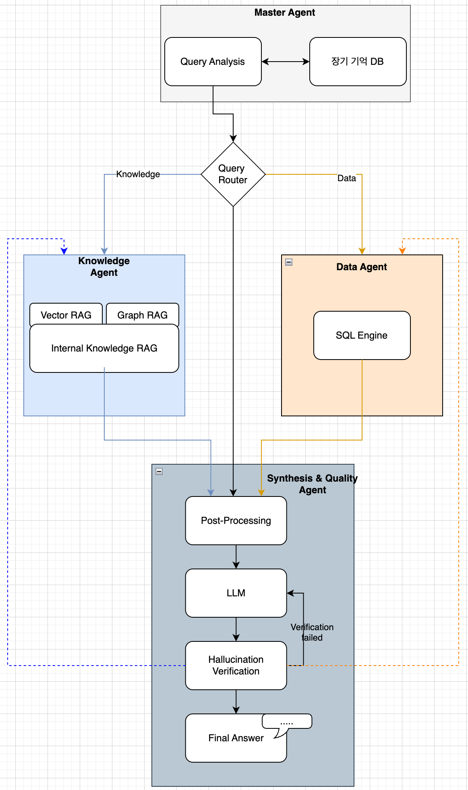
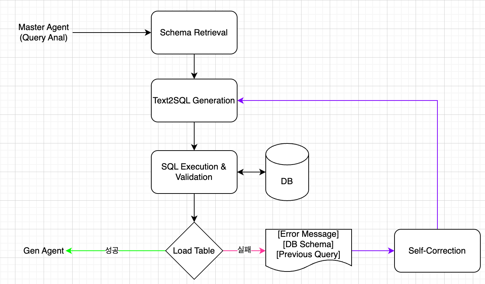
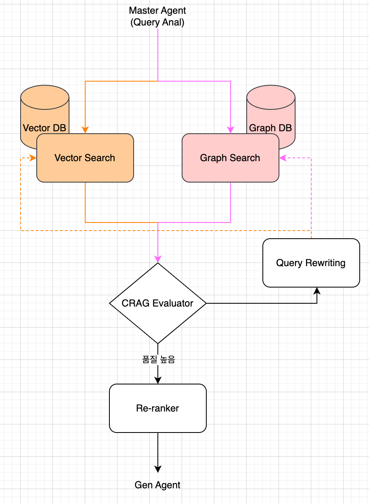

# 🏗️ System Architecture

*LangGraph를 활용한 Multi-Agent 오케스트레이션 및 상태 관리 흐름도*
### 📊 Data Expert (Text2SQL)

[cite_start]*1.1억 건의 제조 로그 분석을 위한 시맨틱 스키마 매핑 및 SQL 생성 과정*

### 📚 Knowledge Expert (CRAG & RAG)

[cite_start]*Hybrid Search 기반 지식 추출 및 CRAG 알고리즘을 통한 답변 교정 루프*

# 🔋 HMG Battery QA Multi-Agent System
1.1억 건의 제조 데이터와 기술 가이드북을 결합한 지능형 품질 관제 에이전트

본 프로젝트는 대규모 배터리 생산 공정에서 발생하는 1.1억 건의 시계열 로그 데이터와 비정형 기술 가이드북을 통합 분석하여, 생산 현장의 불량 원인을 진단하고 최적의 조치 가이드를 제공하는 Multi-Agent 시스템입니다. 

# 🚀 Key Highlights
- Massive Scale Text2SQL Optimization: 1.1억 건 규모의 400+ 컬럼 데이터를 처리하기 위한 Semantic Schema Pruning 기법 적용. 
- Self-Corrective RAG (CRAG): 검색 결과의 관련성을 스스로 평가하고 품질 미달 시 Query Rewriting을 통해 답변의 신뢰성 확보. 
- White-box Reasoning Trace: 에이전트의 내부 사고 과정(Prompt, SQL, Search Result)을 투명하게 공개하여 제조 현장의 설명 가능한 AI(XAI) 구현. 
- High-Performance Inference: **Groq LPU (Llama-3.3-70B)**를 활용하여 대규모 분석 시나리오에서도 초저지연 응답 속도 달성. 

# 🏗️ System Architecture
- 시스템은 LangGraph를 기반으로 한 상태 중심(State-centric) 오케스트레이션 구조로 설계되었습니다. 
1. Query Router: 질문의 의도를 분석하여 일반 대화(LLM), 수치 분석(DATA), 지식 검색(KNOWLEDGE) 경로를 동적으로 결정. 
2. Data Expert (SQL): Semantic Dictionary를 활용해 400여 개의 센서 컬럼 중 연관 항목만 추출하여 효율적인 SQL 생성 및 분석 수행. 
3. Knowledge Expert (RAG): OpenSearch 기반 Hybrid Search를 통해 가이드북 내 정밀 지식 추출. 
4. CRAG Grader/Rewriter: 검색 결과의 품질을 채점하고 부적합 시 질문을 재구성하여 검색 품질을 개선(Rewriting). 
5. Final Responder: 데이터 분석 결과와 기술 지식을 결합하여 전문적인 품질 리포트 생성. 

# 🛠️ Technical Deep Dive (Engineering Points)

단순한 LLM API 호출을 넘어, 대규모 데이터 환경에서의 성능과 신뢰성을 위해 다음과 같은 엔지니어링을 수행했습니다. 

1. Context-Aware Text2SQL 고도화
Schema Pruning: 400개가 넘는 모든 컬럼을 프롬프트에 넣는 대신, 질문과 연관된 컬럼만 시맨틱 사전에서 동적으로 필터링하여 주입함으로써 SQL 생성 정확도 개선 및 토큰 비용 70% 절감. 
Asset Hierarchy Integration: AASX(Asset Administration Shell) 표준을 분석하여 팩-모듈-셀 간의 계층 구조를 LLM에게 학습시켜 복합적인 수치 분석 능력 확보. 

2. 검색 품질 최적화 (Hybrid Search & CRAG)
Hybrid Retrieval: 벡터 유사도의 한계를 보완하기 위해 **BM25(Lexical)**와 Semantic Search를 결합하여 전문 용어에 대한 검색 Precision 강화.
Self-Correction Loop: 검색된 문서가 질문에 대한 답을 포함하지 않을 경우, LLM이 이를 인지하고 검색어(Query)를 스스로 재구성하여 다시 시도하는 CRAG 알고리즘 구현. 

3. 정량적 성능 평가 체계
에이전트의 답변에 대한 Faithfulness(충실도)와 Relevance(관련성)를 평가하는 프레임워크 설계. 

# 🛠️ Tech Stack

- LLM: Llama-3.3-70B-Versatile (Groq LPU)
- Framework: LangGraph, LangChain, Streamlit
- Storage: SQLite (1.1B rows), OpenSearch (Hybrid Search)
- Analysis: PySpark, Semantic Mapping Layer
- Evaluation: nDCG@5, F1-Score 


# 📈 Performance & Optimization
- Context Pruning: 400개 이상의 컬럼 중 질문 연관 항목만 선택 주입하여 토큰 비용 70% 절감. 
- Search Quality: BM25와 시맨틱 필터링을 결합하여 기술 용어 검색 정확도 개선 (과거 nDCG@5 14% 향상 경험 기반 설계). 
- Real-time Trace: 각 노드별 실행 로그를 JSON 형태로 시각화하여 디버깅 및 운영 신뢰성 확보. 

```python
# 1. 환경 설정
git clone https://github.com/thekim9304/battery-qa-multi-agent
cd battery-qa-multi-agent
pip install -r requirements.txt

# 2. 인프라 실행 (OpenSearch)
docker-compose up -d

# 3. 서비스 실행
streamlit run streamlit_app.py --server.address=0.0.0.0
```
